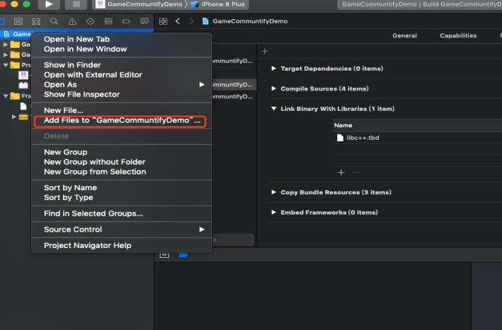
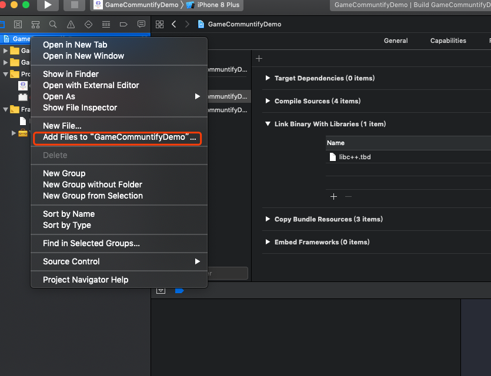
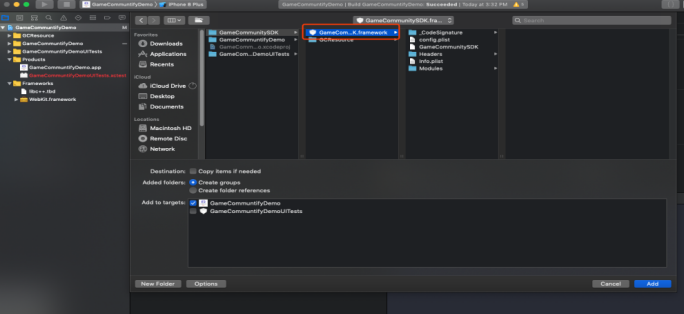
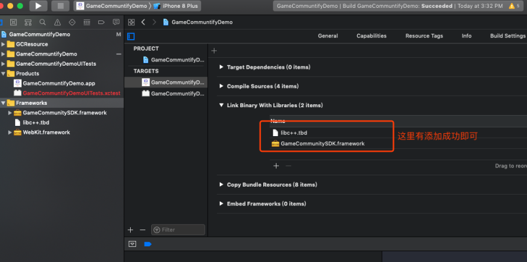

============
SDK资源导入
============

拷贝资源文件到对应工程目录下
=========================

.. image::  ../images/image1.jpg

添加bundle资源
==============

.. image::  ../images/image3.jpg

注：五个bundle资源根据自己工程需求选择对应的bundle资源也可以五个bundle资源都选（同时配置对应的WeGamersSDKParams中的 GameCommunityThemType skinType）

.. image::  ../images/image4.jpg

添加framework
================

